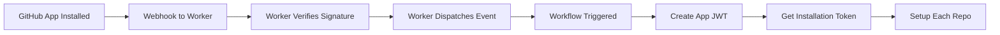

# Leaderboard Bot - Cloudflare Worker

A Cloudflare Worker that handles GitHub App webhook events and forwards installation events to the automation repository for processing.

## Features

- Receives GitHub App webhook events (installation and installation_repositories)
- **Secure webhook signature verification** using HMAC-SHA256
- Forwards relevant events to the automation repository via `repository_dispatch`
- **Automated repository setup** via GitHub Actions workflow
- Built with TypeScript for type safety
- Comprehensive test coverage with Vitest
- Easy deployment with Wrangler

## Prerequisites

- [Node.js](https://nodejs.org/) (v18 or later)
- [pnpm](https://pnpm.io/) package manager
- [Cloudflare account](https://dash.cloudflare.com/sign-up)
- [Wrangler CLI](https://developers.cloudflare.com/workers/wrangler/) (installed via pnpm)
- GitHub Personal Access Token with `repo` scope

## Setup

### 1. Install Dependencies

```bash
pnpm install
```

### 2. Configure Wrangler

Edit `wrangler.toml` and set your Cloudflare account ID:

```toml
account_id = "your-account-id-here"
```

You can find your account ID in the Cloudflare dashboard or by running:

```bash
pnpm wrangler whoami
```

### 3. Set Secrets

Set the required secrets for the worker:

```bash
# GitHub Personal Access Token for triggering repository_dispatch
pnpm wrangler secret put AUTOMATION_REPO_TRIGGER_TOKEN

# GitHub webhook secret for signature verification
pnpm wrangler secret put GITHUB_WEBHOOK_SECRET
```

**AUTOMATION_REPO_TRIGGER_TOKEN** - GitHub Personal Access Token that needs:
- `repo` scope (to trigger repository_dispatch events)
- Access to the `rithviknishad/leaderboard-bot` repository

**GITHUB_WEBHOOK_SECRET** - The webhook secret you configure in your GitHub App settings. This is used to verify that webhook requests are actually coming from GitHub using HMAC-SHA256 signatures.

### 4. Configure GitHub Repository Secrets

For the automation workflow to work, add these secrets to your `rithviknishad/leaderboard-bot` repository:

1. Go to repository Settings → Secrets and variables → Actions
2. Add the following secrets:

- **LEADERBOARD_APP_ID**: Your GitHub App ID (found in App settings)
- **LEADERBOARD_APP_PRIVATE_KEY**: Your GitHub App private key (PEM format)

To generate a private key for your GitHub App:
1. Go to your GitHub App settings
2. Scroll to "Private keys" section
3. Click "Generate a private key"
4. Save the downloaded `.pem` file contents as the secret value

## Development

### Run Locally

Start the development server:

```bash
pnpm dev
```

This will start a local server (typically at `http://localhost:8787`) where you can test the worker.

### Test the Worker

You can test the worker locally using curl:

```bash
# Test GET request (should return "ok")
curl http://localhost:8787

# Test POST with installation event
curl -X POST http://localhost:8787 \
  -H "x-github-event: installation" \
  -H "Content-Type: application/json" \
  -d '{"action":"created","installation":{"id":12345}}'
```

### Run Tests

Run the test suite:

```bash
# Run tests once
pnpm test

# Run tests in watch mode
pnpm test:watch
```

### Type Check

Check TypeScript types:

```bash
pnpm type-check
```

## Deployment

### Deploy to Cloudflare Workers

```bash
pnpm deploy
```

This will:
1. Build your worker
2. Upload it to Cloudflare
3. Make it available at your worker URL

### Configure GitHub Webhook

After deployment:

1. Go to your GitHub App settings
2. Set the Webhook URL to your worker URL (e.g., `https://leaderboard-bot.your-subdomain.workers.dev`)
3. **Set a webhook secret** - Generate a secure random string and save it (you'll need to add it as `GITHUB_WEBHOOK_SECRET` in Wrangler secrets)
4. Subscribe to these events:
   - `installation`
   - `installation_repositories`

**Important:** The worker requires webhook signature verification. Make sure the webhook secret in your GitHub App settings matches the `GITHUB_WEBHOOK_SECRET` you configured in step 3 of the setup.

## How It Works

1. GitHub sends webhook events to the worker when:
   - Your app is installed on a repository (`installation` event)
   - Repositories are added/removed from the installation (`installation_repositories` event)

2. The worker **verifies the webhook signature** using HMAC-SHA256 to ensure the request is authentic

3. The worker validates the request and filters for relevant events

4. For installation-related events, the worker forwards them to `rithviknishad/leaderboard-bot` via the GitHub API's `repository_dispatch` endpoint

5. The automation repository can then handle the event with a GitHub Actions workflow

## Installation Handler Workflow

The repository includes a GitHub Actions workflow (`.github/workflows/handle-installation.yml`) that automatically processes installation events:

### What It Does

1. **Receives repository_dispatch events** from the Cloudflare Worker
2. **Authenticates as the GitHub App** using JWT and creates installation tokens
3. **Processes each installed repository**:
   - Verifies repository access
   - Sets up leaderboard configuration
   - Creates necessary workflow files
   - Initializes leaderboard data

### How It Works



### Customizing the Workflow

The workflow includes a placeholder section where you can add your custom setup logic:

```javascript
// TODO: Add your leaderboard setup logic here
// Examples:
// 1. Create/update leaderboard workflow file
// 2. Create leaderboard configuration file
// 3. Initialize leaderboard data
// 4. Create initial PR with setup
```

Edit `.github/workflows/handle-installation.yml` to implement your specific setup requirements.

## Project Structure

```
.
├── .github/
│   └── workflows/
│       ├── test.yml                    # CI/CD test workflow
│       └── handle-installation.yml     # Installation handler workflow
├── src/
│   ├── index.ts          # Main worker code
│   └── index.test.ts     # Test suite
├── wrangler.toml         # Cloudflare Worker configuration
├── tsconfig.json         # TypeScript configuration
├── vitest.config.ts      # Vitest configuration
├── package.json          # Dependencies and scripts
├── SECURITY.md          # Security documentation
└── README.md            # This file
```

## Environment Variables

### Cloudflare Worker Secrets (via `wrangler secret put`)

- `AUTOMATION_REPO_TRIGGER_TOKEN`: GitHub Personal Access Token for triggering repository_dispatch events
- `GITHUB_WEBHOOK_SECRET`: Webhook secret for verifying GitHub webhook signatures (must match the secret configured in GitHub App settings)

### GitHub Repository Secrets (in repository settings)

- `LEADERBOARD_APP_ID`: GitHub App ID
- `LEADERBOARD_APP_PRIVATE_KEY`: GitHub App private key (PEM format)

## Troubleshooting

### Worker returns "missing AUTOMATION_REPO_TRIGGER_TOKEN"

Make sure you've set the secret:

```bash
pnpm wrangler secret put AUTOMATION_REPO_TRIGGER_TOKEN
```

### Worker returns "invalid signature" (401)

This means the webhook signature verification failed. Check that:
- You've set the `GITHUB_WEBHOOK_SECRET` in Wrangler: `pnpm wrangler secret put GITHUB_WEBHOOK_SECRET`
- The secret matches exactly what you configured in your GitHub App webhook settings
- The request is actually coming from GitHub (not a test request without proper signature)

### Worker returns "missing x-hub-signature-256 header" (401)

The webhook request is missing the signature header. This typically means:
- The request is not coming from GitHub
- You need to configure a webhook secret in your GitHub App settings

### GitHub API returns 401 Unauthorized

Check that your token has the correct permissions:
- `repo` scope
- Access to the target repository

### Events are being ignored

Verify that:
- The `x-github-event` header is set to `installation` or `installation_repositories`
- The request body contains valid JSON
- The webhook signature is valid

## License

MIT

